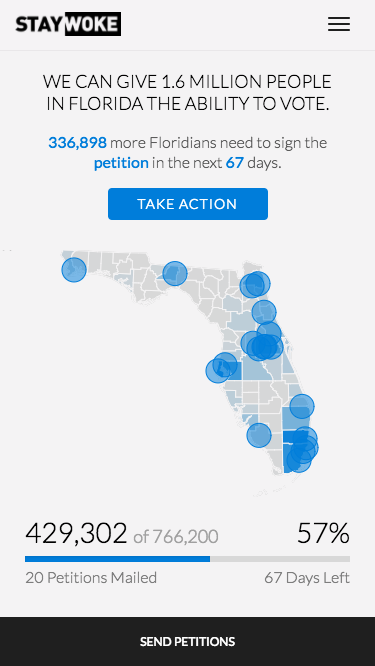

End Disenfranchisement
===

We can make it possible for 1.6 million more Floridians - including 1 in 4 black Floridians - to vote during the next Presidential election. We need 544,000 more Florida registered voters to sign this petition by February 1st, 2018 to put this voting rights restoration initiative on the ballot.

Embed Instructions
---



To Embed this Widget into Your Website, add the following Script Tag wherever you want the widget to show up.

```html
<script src="https://florida.ourstates.org/embed.js" id="ourstates-florida-script" defer></script>
```

If you would like to customize the size of the widget, you can add custom CSS to your site.  Just note that we did not design for widths less than `320px`.

```html
<style>
#ourstates-florida-widget {
  width: 500px !important;
  height: 500px !important;
}
</style>
```
